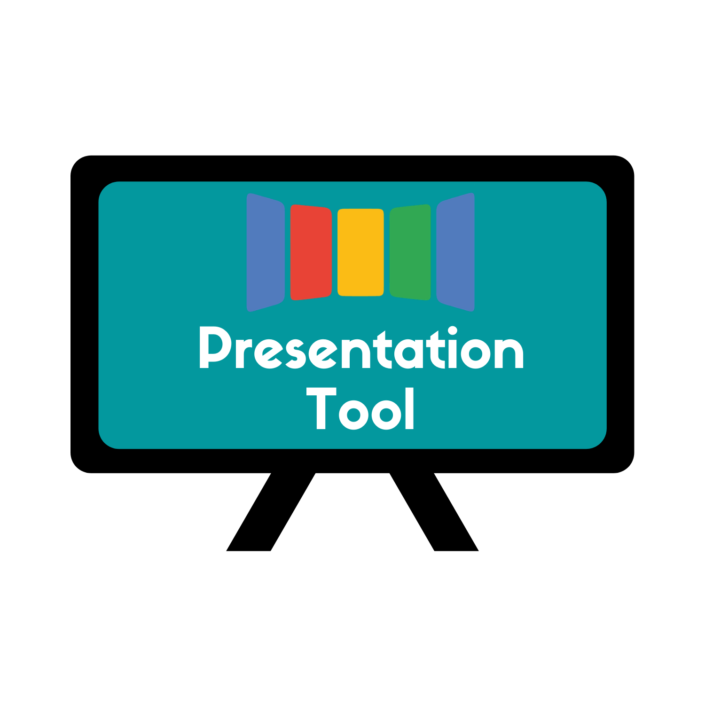

 
# Presentation Tool
// badges will go here

## About

Lorem ipsum dolor sit amet, consectetur adipiscing elit. Vestibulum in neque sed ipsum fringilla consequat. Maecenas sit amet dui iaculis, pretium mauris quis, tincidunt sapien. In et mollis nulla. Fusce fermentum interdum vehicula. Vivamus congue placerat nisl, nec venenatis nibh finibus at. Nunc lacus ante, blandit quis hendrerit vitae, mollis quis nunc. Sed sed neque ipsum. Integer rutrum purus feugiat velit bibendum pretium. Ut pellentesque neque non eros aliquam suscipit. Donec ullamcorper varius dui, sit amet rutrum turpis porttitor eget. Pellentesque sit amet dolor vel nisi pellentesque cursus sed vel quam. Quisque risus ligula, rutrum nec lobortis eget, vestibulum quis mi. Quisque quis porta magna. Phasellus vel feugiat urna.

### Use cases

* A person wants to present the photos of her/his last trip together with a tour on Earth of the places she/he visited

* Liquid Galaxy needs to present historical information about a chosen monument. Earth orbiting the point. Videos, images and text showing information dynamically

* Someone wants to create a presentation to show graphics and sales results of a company, show different videos, images and texts. A Liquid Galaxy can display many information at once, more screens, more space

* A teacher wants to present a new subject to students in a more ludic way. He/she intends to use videos, images and audio to catch the students attention

* A person has the objective of raising awareness about ecological disasters and wants to present the now and then of different forests with great impact

### Main technologies/languages used
* Javascript
* Bash
* [MongoDB](https://www.mongodb.com/)
* [Nodejs](https://nodejs.org/en/)
* [Vue.js](https://vuejs.org/)

## Installation guide

Lorem ipsum dolor sit amet, consectetur adipiscing elit. Vestibulum in neque sed ipsum fringilla consequat. Maecenas sit amet dui iaculis, pretium mauris quis, tincidunt sapien. In et mollis nulla. Fusce fermentum interdum vehicula. Vivamus congue placerat nisl, nec venenatis nibh finibus at. Nunc lacus ante, blandit quis hendrerit vitae, mollis quis nunc. Sed sed neque ipsum. Integer rutrum purus feugiat velit bibendum pretium. Ut pellentesque neque non eros aliquam suscipit. Donec ullamcorper varius dui, sit amet rutrum turpis porttitor eget. Pellentesque sit amet dolor vel nisi pellentesque cursus sed vel quam. Quisque risus ligula, rutrum nec lobortis eget, vestibulum quis mi. Quisque quis porta magna. Phasellus vel feugiat urna.

## Full documentation

// link to full documentation

## Issues and contributing

Lorem ipsum dolor sit amet, consectetur adipiscing elit. Vestibulum in neque sed ipsum fringilla consequat. Maecenas sit amet dui iaculis, pretium mauris quis, tincidunt sapien. In et mollis nulla. Fusce fermentum interdum vehicula. Vivamus congue placerat nisl, nec venenatis nibh finibus at. Nunc lacus ante, blandit quis hendrerit vitae, mollis quis nunc. Sed sed neque ipsum. Integer rutrum purus feugiat velit bibendum pretium. Ut pellentesque neque non eros aliquam suscipit. Donec ullamcorper varius dui, sit amet rutrum turpis porttitor eget. Pellentesque sit amet dolor vel nisi pellentesque cursus sed vel quam. Quisque risus ligula, rutrum nec lobortis eget, vestibulum quis mi. Quisque quis porta magna. Phasellus vel feugiat urna.

## Support

## License