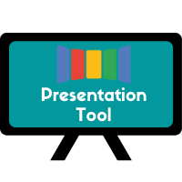

 
# Presentation Tool
     

## About

The Presentation Tool project started as a project for Google Summer of Code 2020. The main idea is to have a software that is capable to create different sets of data configuration to be displayed on a Liquid Galaxy. 

Liquid Galaxy is a very powerful tool to visualize data, the elevated computing power given by the main-secondary architecture and the larger visualiazation brings a very interesting field to show different types of media in bigger scales. 

The API idea is to empower this capability of Liquid Galaxy by proposing the execution of different types of media at the same time using the multiple processing with bash. 

To deal with those creations, the API was developed to manage presentations. A presentation is a set of commands an user gives to the API, those commands are parsed and translated to open sets of media on specified positions, screens and time. 

To help users manage the presentations, a tool was created to serve as a user interface connected directly with the API.

Because it consists of overlaying processes, the Presentation Tool can be used on top of Google Earth. Due to this powerful partnership, the Presentation Tool is integrated with the query system of Google Earth, making it possible to do queries while displaying the media.

### Use cases

* A person wants to present the photos of her/his last trip together with a tour on Earth of the places she/he visited

* Liquid Galaxy needs to present historical information about a chosen monument. Earth orbiting the point. Videos, images and text showing information dynamically

* Someone wants to create a presentation to show graphics and sales results of a company, show different videos, images and texts. A Liquid Galaxy can display many information at once, more screens, more space

* A teacher wants to present a new subject to students in a more ludic way. He/she intends to use videos, images and audio to catch the students attention

* A person has the objective of raising awareness about ecological disasters and wants to present the now and then of different forests with great impact

### Main technologies and languages used

* Javascript
* Bash
* [MongoDB](https://www.mongodb.com/)
* [Nodejs](https://nodejs.org/en/)
* [Vue.js](https://vuejs.org/)

## Installation guide

### Install the API

Follow the [install backend guide](./backend/readme.md) to install the API and all its pre-requisites.

The API can be used alone if you use softwares like Postman, for example, to make all the API requests.

All the possible endpoints are described on the [readme](./backend/readme.md) of the backend session

### Install the user interface

If you prefer an easier way and more user friendly to interact with this software, install the user interface by following the [install frontend guide](./frontend/presentation-tool/README.md).

The user interface is meant to be used with the API, it is useless if not working with an already set up backend. 

## Full documentation

To further information about the project checkout the full documentation in our [wiki](https://github.com/LiquidGalaxyLAB/Presentation-Tool/wiki).

## Issues and contributing

Fill up issues, bugs or feature requests in [our issue tracker](https://github.com/LiquidGalaxyLAB/Presentation-Tool/issues/new).

Please try to be very descriptive and clear. 

If you want to contribute, make sure to take a look at the full documentation and open a [pull request](https://github.com/LiquidGalaxyLAB/Presentation-Tool/compare).

## License

This software is under the [Apache 2.0 License](https://opensource.org/licenses/Apache-2.0)

Copyright 2020 [Karine Aparecida Pistili Rodrigues](https://www.linkedin.com/in/karine-pistili)